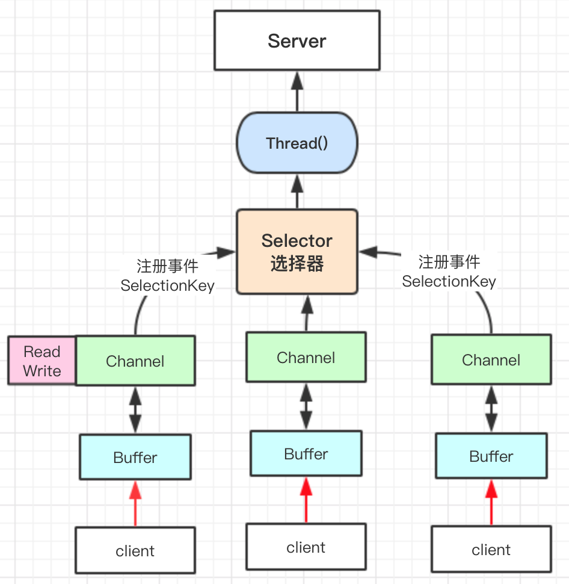

# JAVA IO模型

Java共支持三种网络编程I/O模式
- BIO
  - 同步并阻塞
- NIO
  - 同步非阻塞
    - 多路复用选择器 Selector
    - 
    - Reactor模式
- AIO
  - 异步非阻塞
  - Proactor模式
  
## BIO (blocking IO)
### 编程模型：
 - 1.服务器端启动一个ServerSocket
 - 2.客户端启动Socket对服务器进行通信，默认情况下服务器端会对每个客户建立一个线程与之通讯。
 - 3.客户端发出请求后，先咨询服务器是否有线程响应，如果没有，则会等待或被决绝；如果有响应，客户端线程会等待请求结束后，再继续执行。
### 问题分析：
 - 每个请求都需要建立独立的线程，与对应的client进行数据的read、write、业务处理。
 - 并发较大时，要创建大量的线程来处理连接。
 - 线程阻塞，资源浪费。
### code 
@See com.boatfly.codehub.netty.io.bio.TestBlockingIO

## NIO (non-blocking IO)
@since jdk1.4
面向缓冲区，或者说面向块编程的。
- 非阻塞模式
- 可以做到一个线程处理多个操作
- HTTP2.0使用了`多路复用`的技术，做到一个连接并发处理多个请求，其并发请求比HTTP1.0大了很多个数量级。

核心技术：
- 通道 Channel
  - 注册`事件`到selector。
- 缓冲区 Buffer
  - 一个内存块，底层是一个数组。
    - `final int[] hb;                  // 每个类型的Buffer，都会定义数组变量hb，以IntBuffer为例`
  - 数据总是从通道读取到缓冲区，或者从缓冲区写入通道；
- 选择器 Selector
  - 用于监听多个通道的事件（如：连接请求、数据到达等），因此使用单个线程可以监听多个客户端通道。
  - 会根据不同的`事件`在多个通道上进行切换。
  - Netty的IO线程NioEventLoop聚合了Selector（选择器 or 多路复用器）
  - method
    - open
    - select
      - select()阻塞
      - select(1000)阻塞1000毫秒，在1000毫秒后返回
      - wakeup() 唤醒selector
      - selectNow() 不阻塞，马上返回
    - selectedKey
      - 可以反向获取channel
      - OP_READ = 1 << 0
        - 0000 0001 -> 0
      - OP_WRITE = 1 << 2
        - 0000 0100  -> 4
      - OP_CONNECT = 1 << 3
        - 0000 1000  ->8
      - OP_ACCEPT = 1 << 4
        - 0001 0000 -> 16

### NIO非阻塞网络编程原理分析
- 当客户端连接时，会通过ServerSockerChannel得到SocketChannel。
- 将socketChannel注册到selector上，register(Selector sel,int ops)，一个selector可以注册多个socketChannel
- 注册后返回一个SelectorKey，会和该selector进行关联（集合）。
- Selector进行监听，select方法，返回有事件发生的通道个数
- 进一步得到各个selectorkey（有事件发生）
- 通过selectorkey反向获取socketchannel，方法channel()
- 可以通过得到的channel，完成业务处理。

### 原生NIO存在的问题
- NIO的类库 和API 繁杂。
- 需要对多线程和网络编程，reactor模式，非常熟悉才能写出高质量的代码
- 开发工作量和难度大：
  - 断连重连
  - 网络闪断
  - 半包读写
  - 失败缓存
  - 网络拥塞
  - 异常流等
- Bug：
  - Epoll Bug；

