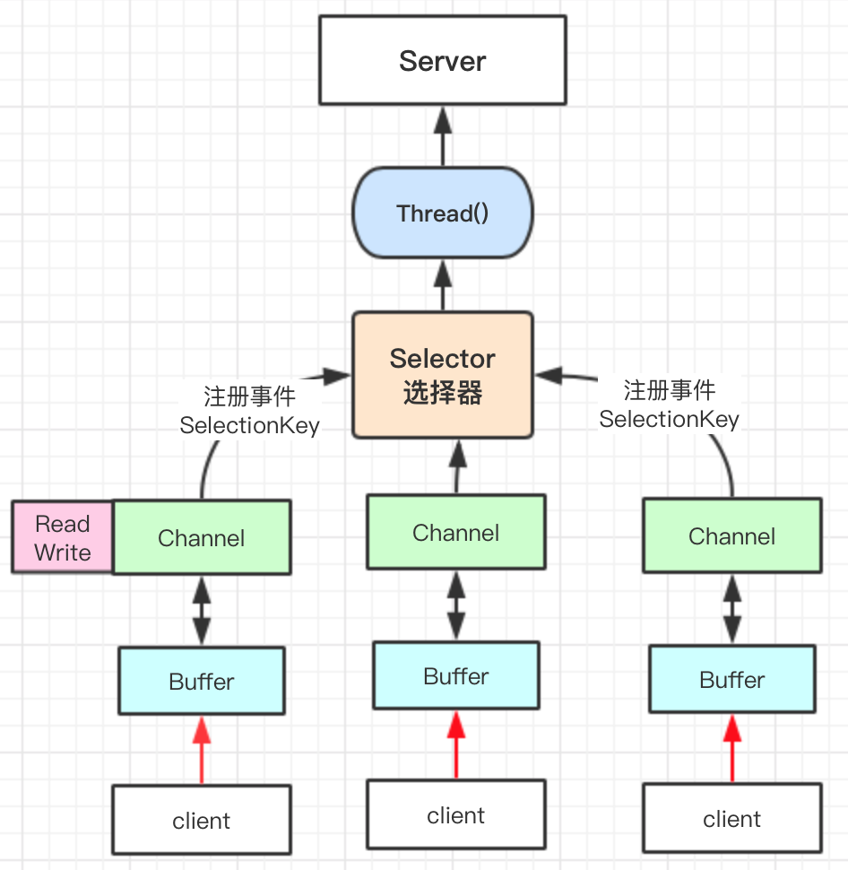

# JAVA IO模型

Java共支持三种网络编程I/O模式
- BIO
  - 同步并阻塞
- NIO
  - 同步非阻塞
    - 多路复用选择器 Selector
    - 
- AIO
  - 异步非阻塞
  
## BIO (blocking IO)
### 编程模型：
 - 1.服务器端启动一个ServerSocket
 - 2.客户端启动Socket对服务器进行通信，默认情况下服务器端会对每个客户建立一个线程与之通讯。
 - 3.客户端发出请求后，先咨询服务器是否有线程响应，如果没有，则会等待或被决绝；如果有响应，客户端线程会等待请求结束后，再继续执行。
### 问题分析：
 - 每个请求都需要建立独立的线程，与对应的client进行数据的read、write、业务处理。
 - 并发较大时，要创建大量的线程来处理连接。
 - 线程阻塞，资源浪费。
### code 
@See com.boatfly.codehub.netty.io.bio.TestBlockingIO

## NIO (non-blocking IO)
@since jdk1.4
面向缓冲区，或者说面向块编程的。
- 非阻塞模式
- 可以做到一个线程处理多个操作
- HTTP2.0使用了`多路复用`的技术，做到一个连接并发处理多个请求，其并发请求比HTTP1.0大了很多个数量级。

核心技术：
- 通道 Channel
- 缓冲区 Buffer
  - 数据总是从通道读取到缓冲区，或者从缓冲区写入通道；
- 选择器 Selector
  - 用于监听多个通道的事件（如：连接请求、数据到达等），因此使用单个线程可以监听多个客户端通道。

